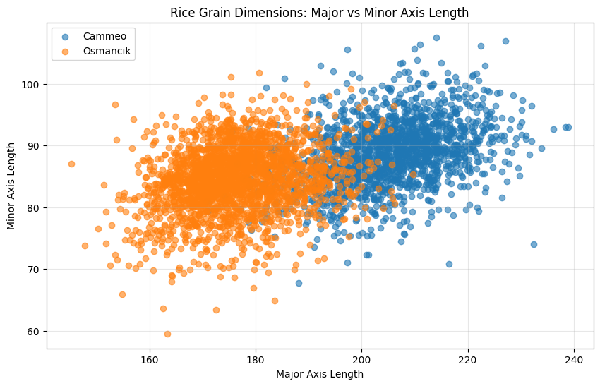

# Assignment 1 - Part A - Infrastructure Setup
CS-4320-01 Machine Learning \
Stephen Harris \
2026 Jan 20, Tuesday


## 1. Google Colab

### First line of data from the data file
```csv
 	Area 	Perimeter 	Major_Axis_Length 	Minor_Axis_Length 	Eccentricity 	
Convex_Area 	Extent 	Class
0 	15231 	525.578979 	229.749878 	85.093788 	0.928882 	15617 	0.572896 	Cammeo
```


### Image generated



### Mean and standard deviation of Perimeter for the Cammeo class

```
Aggregate Statistics (Class: Cammeo)
  Perimeter Mean: 487.44
  Perimeter Std Dev: 22.18
  Sample Count: 1630
```


## 2. Local Environment

### First line of data from the data file

```csv
    Area   Perimeter  Major_Axis_Length  ...  Convex_Area    Extent   Class
0  15231  525.578979         229.749878  ...        15617  0.572896  Cammeo
```

### Image generated


### Average perimeter and standard deviation of perimeter for Cammeo class rice kernels

```
Aggregate Statistics:
----------------------------------------
Class: Cammeo
  Perimeter Mean: 487.44
  Perimeter Std Dev: 22.18
  Sample Count: 1630
```


## 3. Data loading verification

### Google Collab

```
Reading CSV from GitHub raw URL: https://raw.githubusercontent.com/stephen010x/
ut_collab_data/refs/heads/main/assignment-01/2026-20-aaa-220-Rice_Cammeo_Osmancik.csv
Successfully loaded 3810 rows and 8 columns
```


### Local Environment

```
Loading CSV file with pandas...
Successfully loaded 3810 rows and 8 columns
```


## 4. Reproducibility artifacts

<!--Reference [task 1](#1-google-colab) and [task 2](2-local-environment) I guess?-->

Reference `1. Google Colab` and `2. Local Environment` I guess?


## 5. Reflection

I suppose Google Colab was the easiest, once I figured out how to use it. But I might also list Colab as the most frustrating, as it was a pain to figure out, and anything that requires a browser interface is inconvenient to me as opposed to a terminal interface. I expect myself to be using my local environment the most, simply because it will be very easy for me to keep everything organized, easy to run, and isolated from bloated web application interfaces. Though I may reluctantly resort to Google Colab if I have tasks that might be too resource intensive to be ran on my local machines.
